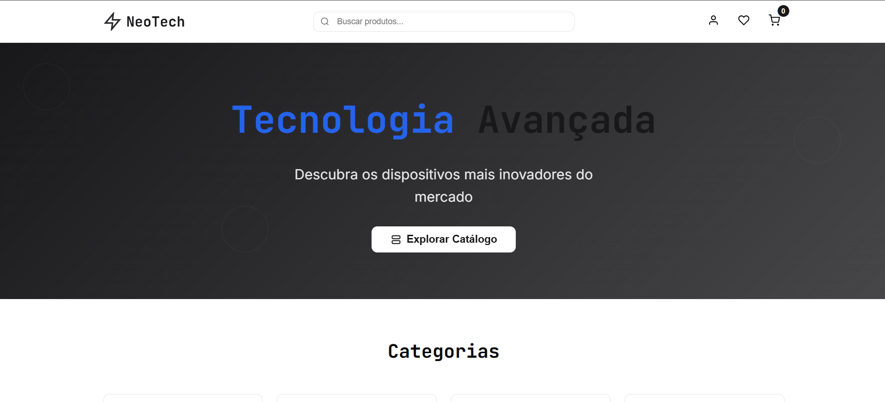

# NeoTech - Loja de Tecnologia



NeoTech é uma interface de e-commerce moderna, limpa e responsiva, desenvolvida com HTML, CSS e JavaScript puro (vanilla). O projeto simula uma loja de produtos de tecnologia, com funcionalidades dinâmicas de busca, filtragem e um carrinho de compras interativo.

## ✨ Funcionalidades

- **Renderização Dinâmica de Conteúdo**: Os produtos e as categorias são carregados dinamicamente a partir de um objeto JavaScript, simulando o consumo de uma API.
- **Filtragem de Produtos**: Filtre os produtos exibidos por categoria com um único clique.
- **Busca em Tempo Real**: A funcionalidade de busca filtra os produtos instantaneamente conforme o usuário digita.
- **Carrinho de Compras Interativo**: Adicione, remova e atualize a quantidade de itens em um carrinho de compras com uma interface de sidebar que desliza pela lateral da tela.
- **Design Responsivo**: A interface se adapta perfeitamente a diferentes tamanhos de tela (desktop, tablet e mobile), incluindo uma barra de busca dedicada para dispositivos móveis.
- **UI/UX Moderna**: Design minimalista com animações suaves, ícones em SVG e efeitos de hover que melhoram a experiência do usuário.

## 📂 Estrutura do Projeto

O projeto está organizado da seguinte forma:

```
techEcommerce/
├── assets/
│   ├── images/
│   │   ├── iphone-15-pro.png
│   │   ├── macbook-pro.png
│   │   └── ... (outras imagens de produtos e categorias)
│   └── icon.png
├── index.html      # Estrutura principal da página
├── styles.css      # Estilização visual e responsividade
└── script.js       # Lógica da aplicação, interatividade e manipulação do DOM
```

- **`index.html`**: Contém a estrutura semântica da página. As seções de produtos e categorias são deixadas vazias propositalmente, pois seu conteúdo é gerado e inserido dinamicamente pelo JavaScript.
- **`styles.css`**: Responsável por toda a aparência do site, incluindo layout, cores, fontes, animações e regras de responsividade (`@media queries`).
- **`script.js`**: O cérebro da aplicação. Ele contém toda a lógica para renderizar produtos, gerenciar o estado do carrinho, e lidar com as interações do usuário.
- **`assets/images/`**: Pasta onde todas as imagens de produtos e categorias devem ser armazenadas para que o `script.js` possa encontrá-las.

## 🚀 Como Executar

Este projeto não requer um servidor ou processo de compilação. Para executá-lo:

1.  Clone este repositório:
    ```bash
    git clone https://github.com/seu-usuario/seu-repositorio.git
    ```
2.  Navegue até a pasta do projeto:
    ```bash
    cd techEcommerce
    ```
3.  Abra o arquivo `index.html` diretamente no seu navegador de preferência (Google Chrome, Firefox, etc.).

## 🛠️ Como Funciona (Análise do Código)

O `script.js` é o coração do projeto e opera com base em alguns conceitos principais:

### 1. Dados Mockados (Mock Data)
No topo do arquivo, os arrays `products` e `categories` simulam os dados que normalmente viriam de um banco de dados ou uma API. Cada objeto contém informações como nome, preço e, crucialmente, o caminho da imagem.

```javascript
const products = [
  {
    id: 1,
    name: "iPhone 15 Pro",
    image: "assets/images/iphone-15-pro.png",
    // ...outras propriedades
  },
  // ...outros produtos
];
```

### 2. Gerenciamento de Estado
Variáveis simples são usadas para controlar o estado atual da aplicação:
- `cartItems`: Um array que armazena os produtos no carrinho.
- `searchQuery`: Armazena o texto atual da barra de busca.
- `selectedCategory`: Armazena a categoria selecionada para filtragem.

### 3. Funções de Renderização
As funções `renderProducts()` e `renderCategories()` são responsáveis por gerar o HTML.

- Elas iteram sobre os arrays de dados (`products` e `categories`).
- Filtram os produtos com base nas variáveis de estado (`searchQuery` e `selectedCategory`).
- Constroem uma string HTML para cada item.
- Injetam o HTML gerado no DOM usando a propriedade `innerHTML` dos elementos correspondentes (`productsGrid` e `categoriesGrid`).

### 4. Manipulação de Eventos
A função `setupEventListeners()` centraliza a configuração de todos os eventos, como:
- Cliques nos botões do carrinho para abrir e fechar a sidebar.
- Digitação nas barras de busca (`input` event).
- Cliques nos botões de filtro de categoria.

### 5. Lógica do Carrinho
Um conjunto de funções gerencia o carrinho de compras:
- `addToCart()`: Adiciona um produto ao array `cartItems` ou incrementa sua quantidade se já existir.
- `removeFromCart()` / `updateQuantity()`: Modificam o carrinho.
- `updateCartUI()`: Re-renderiza a sidebar do carrinho com os itens atualizados, calcula o total e atualiza o contador de itens no cabeçalho.

## 🔮 Possíveis Melhorias

- **Consumir uma API Real**: Substituir os dados mockados por chamadas a uma API de e-commerce (ex: Fake Store API) usando `fetch`.
- **Funcionalidade de Favoritos**: Implementar a lógica para o botão de "favoritar" produtos.
- **Persistência de Dados**: Usar `localStorage` para que o carrinho do usuário não seja perdido ao recarregar a página.
- **Refatoração da Renderização**: Em vez de usar `innerHTML`, refatorar as funções de renderização para usar `document.createElement()` e `appendChild()`. Isso melhora a segurança (prevenindo ataques XSS) e pode otimizar a performance em aplicações maiores.
- **Implementar o Checkout**: Criar a lógica para o botão "Finalizar Compra".

## 💻 Tecnologias Utilizadas

- **HTML5**: Estrutura semântica.
- **CSS3**: Estilização, Flexbox, Grid Layout e animações.
- **JavaScript (ES6+)**: Manipulação do DOM, gerenciamento de estado e interatividade.
- **Google Fonts**: Para a tipografia (famílias `Inter` e `JetBrains Mono`).
